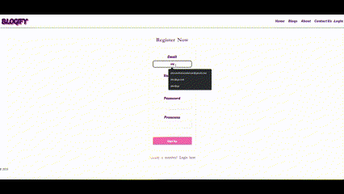
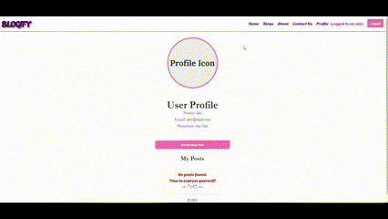
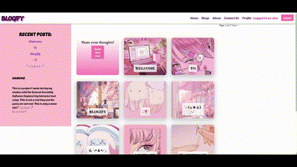
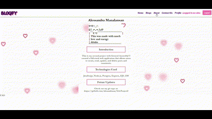

# BLOGIFY: Share Your Passion with the World!

## INTRODUCTION
```Welcome to Blogify, a culmination of the skills and knowledge acquired during my second project at General Assembly. Blogify offers a platform for users to share their personal blogs and engage with others. Whether you're expressing your passions, ideas, or just sharing updates, Blogify ensures you are heard and connected!```

### Features
- **User Profiles**: Sign up, set up your profile, and get started with your blogging journey.
- **Blog Posts**: Create, read, update, and delete your articles with ease.
- **Engaging Interactions**: Dive into a community of bloggers. Comment on posts, start conversations, and build connections.

#### [CHECK IT OUT HERE!](https://blogify-alessandramanalansan.onrender.com)

## Design

#### Wireframe
- View the initial design and flow of the application in this [Figma Wireframe](https://www.figma.com/file/rKi9iyGkngpWkbXYPhIBTi/CRUD-App-Project?type=whiteboard&node-id=0%3A1&t=x05Gs053YP4tyM1O-1).

#### Entity Relationship Diagram (ERD)
- Get a sneak peek into the database architecture with this [ERD](https://lucid.app/lucidchart/f746cd93-7b9c-4a30-8401-f4b3c94280fd/edit?viewport_loc=310%2C314%2C805%2C774%2C0_0&invitationId=inv_a36218db-64a6-4d7f-b24c-fd7826def935).

## Project Details

This project is based on the second unit of our course focusing on full-stack development. Using everything we've learned, we were tasked to create a basic CRUD app of our choice.

I chose a basic blog app that is similar to a social media app that I enjoy using! It has a lot of flaws and is a work in progress but it is functional and ready to use! With Blogify, you can easily sign up, create and publish any blog post you desire. Additionally, you can have a sense of community with the comments section where you can leave reviews and communicate with your fellow bloggers.

## Technologies Used
- JavaScript, Node.js, PostgreSQL, Express, EJS, CSS

## Demo







## Challenges

I faced several challenges during the development of this website. The subject matter was quite challenging for me to grasp initially, and my site often crashed during development. I had difficulty with routing and rewriting. Due to time constraints and some gaps in my knowledge, I couldn't implement everything I had initially planned. However, I managed to complete the essential parts of the project, which is a significant achievement!

## Future Improvements

I want to implement a profile picture system in which the users can upload, edit, delete and update! 